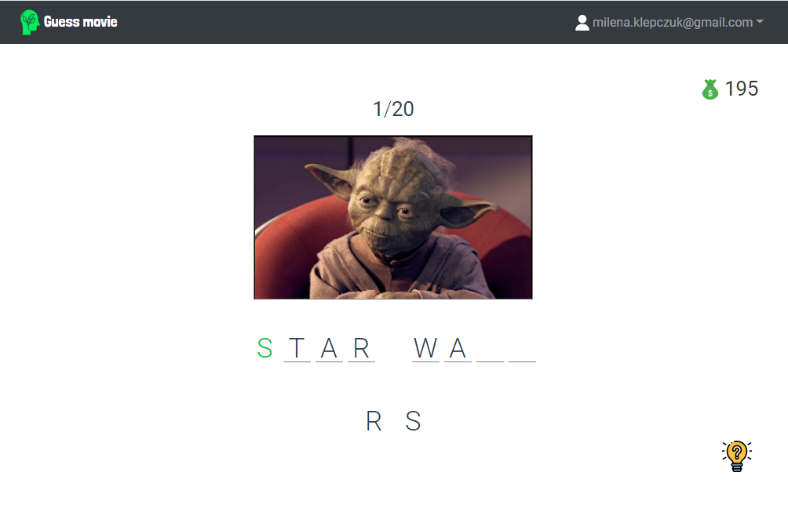

<p id="general-info" align="center">
  <a href="" rel="noopener">
 </a>
</p>

<div align="center">
  
   [](/LICENSE)

</div>

---

<p align="center">
  Film name guessing game based on a video frame and a board with letters in random order. <br><br> 
  You can play the game here: <a href="https://guess-movie.tech"><b>https://guess-movie.tech</b></a> <br> <br> 
  <kbd>
   <a href="https://guess-movie.tech"></a>
  </kbd>
</p>

  
# Table of Contents
1. [General Info](#general-info)
1. [Features](#features)
1. [Technologies](#technologies)
1. [Project setup](#project-setup)
1. [License](#license)
1. [Feedback](#feedback)

  
# Features
  
##  Letters
### Pick a letter
- Picked letter will be assigned to the <b>first empty position</b>.
- Correctly guessing a movie switches automatically to the <b>next puzzle</b>.
- There are <b>no extra letters</b> - all letters suit to puzzle.
  
### Remove a letter
  - You can remove <b>any letter</b> except for already hinted letters.
  
##  Hints
- Taking a hint assigns <b>one letter</b> from scattered letters to a correct position in the puzzle.
- Taking a hint costs <b>5 points</b>.
- The button is <b>disabled</b> when user has no enough score points to pay for it.
- Hinted letters are displayed <b>in green</b> color.

  
### Letter hint priority
  1. Hint for a random <b>empty</b> item.
  1. Hint for a random <b>wrong picked</b> letter (correcting an user mistake).
  
##  Score
- To keep the game simple, the initial score equals <b> 200</b> points.
- Plus <b>10 points</b> for a correctly guessed movie puzzle.
- Guessing a puzzle incorrectly doesn't subtract any points.
- Minus <b>5 points</b> for taking every single letter hint.

##  User actions
- Login (required to play a game).
- Register new user.
- Change user's password.
- Reset user's password by sending an email link with token.


# Technologies 
This project has been made with <b>[Vue.js 3 Framework](https://vuejs.org)</b> and following libraries:
- bootstrap
- vuex 
- axios 
- vue-axios
- vee-validate
- vue-router 

 ## Backend 
- Backend for this project is made with <b>[Symfony 5.2](https://symfony.com)</b> Framework.
- Check out the <b>[backend repository](https://github.com/miKlepczuk/guess-movie-api)</b> of this project.

# Project setup
To run Guess movie locally, you can clone this repository and install its dependencies with npm. You will probably need to install vue-cli.

```
# Install dependencies
npm install

# Compiles and hot-reloads for development
npm run serve

# Compiles and minifies for production
npm run build
```

# License
This project is under [MIT](/LICENSE.md) license. Copyright © 2021 Milena Klepczuk.<br>
All used icons created by <a href="https://www.flaticon.com" title="flaticon"> Freepik - Flaticon</a>.
  
# Feedback
If you have any feedback, please send me an <a href="mailto:milena.klepczuk@gmail.com">email</a> or drop an issue on GitHub. Any feedback is welcome and greatly appreciated.
